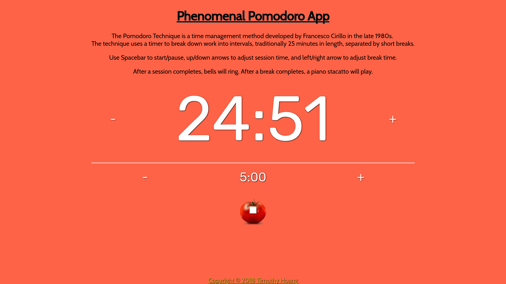
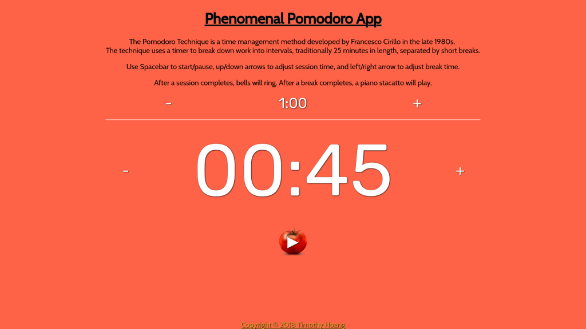

# 0033_pomodoro_app

<figure></figure>

## To view this app online
- To view deployed app, visit: https://timh1203.github.io/pomodoro-app/

## To edit the source code
- Github Repo: https://github.com/timh1203/pomodoro-app
1. Have NPM and NodeJS installed on your computer
2. Navigate to the directory of choice and type `git clone https://github.com/timh1203/pomodoro-app`
3. Alternatively, you can also fork the repo and clone it (no future updates planned)
4. Open up your favorite editor and have fun!

## About
- The Pomodoro App is a basic app based on the Pomodoro Technique by Francesco Cirillo
- The app keeps track of your work and break intervals, usually 25 minutes of work followed by 5 minutes of break
- This app is designed for anyone and can be used by everyone
- Currently: final stage, no more future updates planned (as of 2/11/2018)

## Features
- Ability to increase/decrease both the work and break timers (1 min minimum, no max limit)
- Ability to pause timer an unlimited amount of time
- Automatic transition to break timer after work timer has finished
- Features big numbers during work and break session for easy viewing
- Ability to use keyboard to adjust timers and to start/pause time
- Notifications after work session completion (bells ringing) and break session completion (piano stacatto)
- Tomato icons for thematic fun!

## Minor Features
- `Spacebar` key will start and pause the timer
- `Up/down` arrow keys will adjust the work session time
- `Left/right` arrow keys will adjust the break session time

## App flow
1. Set the desired work and break times, optional to use `arrow keys`
2. Push the tomato start button, optional to use `spacebar`
3. Work timer will start counting down until it reaches 0
- You will be able to pause an unlimited amount of times
- Timer will resume right where you left off after pausing
- Bells will ring to notify you when the work session has ended
4. After work timer hits 0, it will automatically start the break timer
- You will not be able to pause the break timer
- Hopefully this will make you take quick breaks and get back to being productive!
- A piano stacatto will ring to notify you that break session has ended
- After break timer hits 0, it will automatically reset everything
- Now you can adjust the work and break timers again

## Technologies
- HTML
- CSS
- JavaScript
- Sound effects from [FreeSound](https://freesound.org/)

## More pictures
### Break timer Step
<figure></figure>
